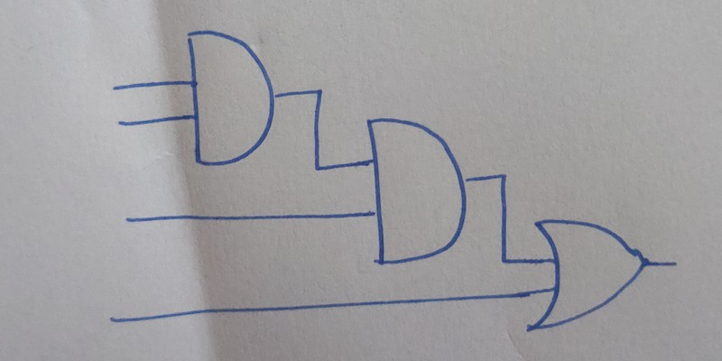

GUI of this application pretty much depicts all the different funationalities and the purpose it serves. Input image for this example is:

For this input image the application converts this hand drawn sketch of a digital circuit into its 2-D graphical format. It also generates its corresponding boolean expression and the truth table.

Truth table for the given example image is:

Also, one can edit the generated 2-D circuit as per their need using the "Openn in Logisim" feature as shown below:

